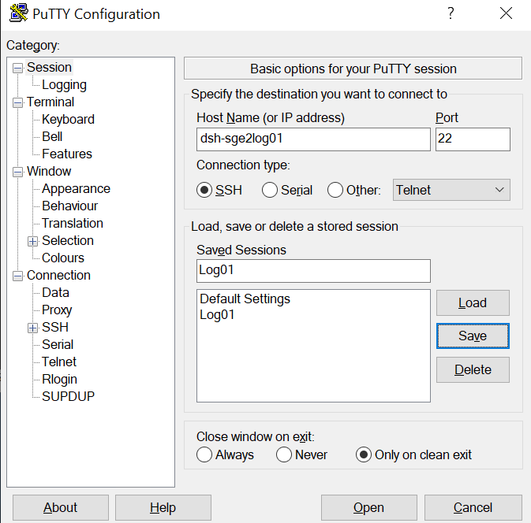
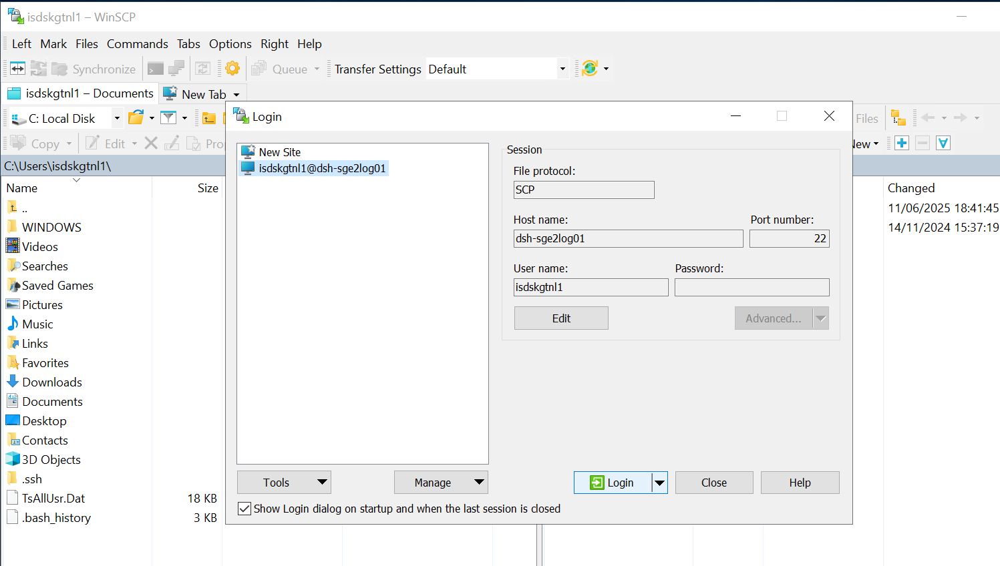
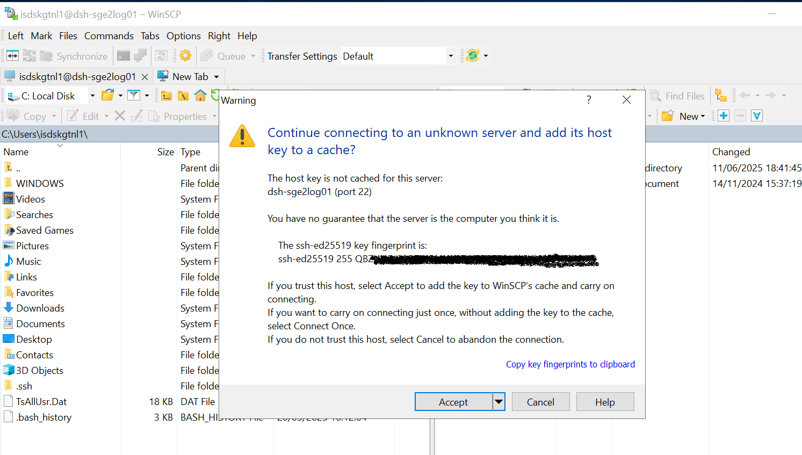
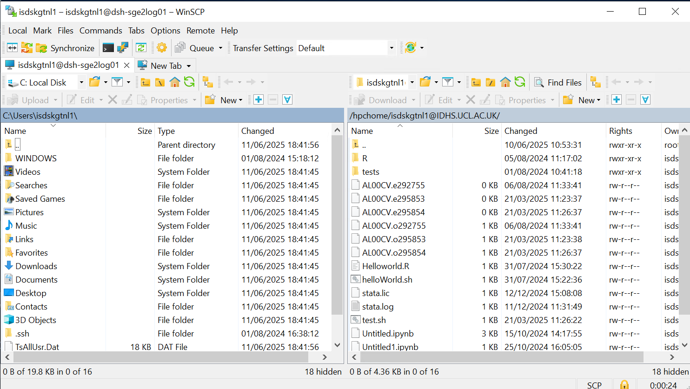
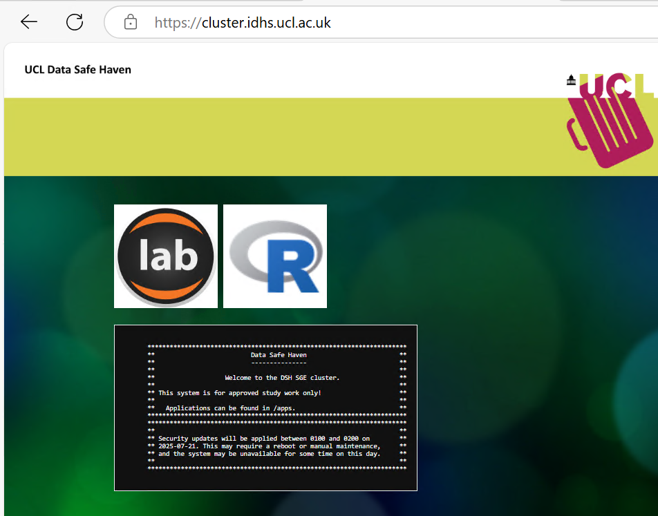

# Data Safe Haven (DSH) HPC Cluster

The DSH HPC cluster is a secure super-computing environment that is isolated from the internet and the UCL network for security and privacy reasons. Relative to some other cluster offerings, it is fairly small scale, so note that it is designed for single-node jobs -- it is not possible to run multi-node parallel jobs. You can find additional information about the DSH HPC cluster in the [DSH user guide and FAQs](https://www.ucl.ac.uk/isd/services/file-storage-sharing/data-safe-haven/data-safe-haven-user-guide-faqs), in the **Research computing** section.

## Accounts

DSH accounts can be applied for via the [DSH sign up process](2-DSH_Intro.md#dsh-account-application). The format of the DSH userid may vary based on the type of account you are provided, the permissions you've been afforded, and whether you are an internal UCL user or an external user.

All DSH users are automatically granted access to the DSH HPC cluster.

## Logging in to the DSH HPC cluster

The DSH HPC cluster can only be accessed from within the DSH "walled garden" environment, so you *must* log in from inside, e.g. using DSH Desktop. The connection to the cluster is typically made via Secure Shell (SSH) connection, and DSH Desktop has terminal applications such as **PuTTY** and **GitBash** installed for this purpose. 

For example, to connect to the cluster using **GitBash**, open a terminal and type the below command to SSH into the machine you wish to access. Replace <DSH_userid> with your DSH userid and <DSH_system_name> with the name of the machine you want to log in to, eg. dsh-sge2log01:

```
ssh <DSH_userid>@<DSH_system_name>
```

You will be prompted to enter your password. Enter it and press **Enter key**. (NOTE: *The prompt will not show your password when you are typing it. This is expected and it is for security reasons. Take care when entering your password.*)

The first time you log in to an unknown server you will get a message like this:

```
The authenticity of host 'dsh-sge2log01 (10.128.114.123)' can't be established.
ECDSA key fingerprint is SHA256:<redacted>.
Are you sure you want to continue connecting (yes/no/[fingerprint])?
```

Typing **yes** will allow you to continue logging in.

If you have access to a [Customer Specialist Server](3.2-Customer_Specialist_Servers.md) or similar private virtual machine in the DSH HPC environment, you can typically just substitute that machine's name for `<DSH_system_name>` above. 

### PuTTY

PuTTY is a common SSH client on Windows and is available on DSH Desktop. If you prefer to use it, you will need to create an entry for the host you are connecting to with the settings below. If you want to save your settings, give them an easily-identifiable name in the "Saved Sessions" box and press "Save". Then you can select it and "Load" next time you use PuTTY.



You will then be asked to enter your username and password. Note that this requires the simple DSH userid (rather than the full "DSH_userid@IDHS.UCL.AC.UK"). The password field will remain entirely blank when you type in to it - it does not show placeholders to indicate you have typed something.

The first time you log in to a new server, you'll get a popup telling you that the server's host key is not cached in the registry - this is normal and is because you have never connected to this server before. If you want to, you can check the host fingerprint against our current key fingerprints.

### Login nodes

The DSH HPC cluster uses two login nodes: `dsh-sge2log01` and  `dsh-sge2log02`, both of which are identical and you can connect to either. The alias `cluster` can also be used as a shortcut to automatically connect to a login node (`dsh-sge2log01` by default). The login nodes allow you to manage your files, compile code and submit jobs. Very short (<15 mins) and non-resource-intensive software tests can be run on the login nodes, but anything more should be submitted to the scheduler as a job, as login nodes are shared resources. Running memory intensive jobs or jobs with long runtimes on the login nodes may negatively impact the performance of the node for other users, so please be mindful. Any user processes identified as being disruptive to normal system operation may be killed without warning.

### Logging in to a specific machine

As noted [above](3-DSH_Cluster.md#logging-in), you can use SSH to access a specific machine by name. Typically this would be one of the login nodes (either `dsh-sge2log01` or `dsh-sge2log02`), or a [Customer Specialist Server](3.2-Customer_Specialist_Servers.md) that has been created for your project. A reminder of the command structure for doing this is provided below. 
```
ssh <DSH_userid>@dsh-sge2log01
ssh <DSH_userid>@dsh-sge2log02
```
  - (Tip 1: The shortform alias `cluster` can also be used to connect to the `dsh-sge2log01` login node)
  - (Tip 2: If you've logged into DSH Desktop using your regular DSH userid, you can typically omit the "<DSH_userid@" portion of the command, for example: `ssh cluster`)

### Login problems
If you experience difficulties logging in to the DSH HPC cluster, please make sure that you are typing your DSH user ID and your password correctly (and note that the DSH userid is distinct from your UCL userid, if you have one). If you have recently updated your password, it may take some time to propagate to all UCL systems -- consider giving it some time and trying again later.

If you still cannot access the DSH HPC, but are able to access DSH Desktop, please contact us on rc-support@ucl.ac.uk indicating you are having difficulty accessing in the DSH HPC Cluster.

If you cannot access anything in the DSH, you may need to request a password reset from the Service Desk. Please, contact our support team - [Data Safe Haven - General DSH Enquiry](https://myservices.ucl.ac.uk/self-service/requests/new/provide_description?from=wizard&requested_for_id=187535&requestor_id=187535&service_id=1473&service_instance_id=3892&subject=Data+Safe+Haven+-+General+DSH+Enquiry%3A&template_id=3222)

## Logging out

You can log out of the systems by typing `exit` and pressing enter (pressing `Ctrl`+`D` also works).

## Copying data into your DSH HPC cluster environment

If you wish to copy data into your DSH HPC cluster home space, first ensure that the data is accessible from inside the DSH environment (e.g. it is in a DSH project share, or in your home space in the DSH Desktop environment). If the data is outside of the DSH, then it must first be copied into the DSH using the [File Transfer Portal](https://filetransfer.idhs.ucl.ac.uk/webclient/Login.xhtml) (note that only some DSH user accounts have privileges for transferring data into and out of the DSH; your project's Information Asset Owner (IAA) or Administrator (IAA) can request these privileges for you, if necessary).

To copy data that is already in the DSH into your DSH HPC cluster environment, you can use the **Secure Copy (SCP)** protocol. For this you can use the **SCP** or **rsync** text commands, or if you prefer to use a graphical interface, the **WinSCP** application provided in the DSH Desktop. (*Note that while **Filezilla** is also installed in the DSH Desktop, it is not supported for the DSH HPC cluster.*)

### SCP

The general syntax for the SCP command is:
```
scp <options> <source_file> <target_destination>
```

Below are some example command templates that could be run from a DSH Desktop terminal application (such as GitBash or PuTTY).

This template will copy a data file (preferably a single compressed file) from somewhere on your DSH Desktop machine to a specified location on the remote machine inside the DSH HPC cluster (login node, etc):
```
scp <local_data_file_path> <DSH_userid>@<DSH_system_name>:<remote_path>/
# Example: scp mylocalfile.txt mydshuserid@dsh-sge2log01:~/myremotepath/
```
The next command uses the SCP recursive option to transfer a folder with several files and directories inside:
```
scp -r <local_data_file_path> <DSH_userid>@<DSH_system_name>:<remote_path>
# Example: scp -r mylocalfolder mydshuserid@cluster:~/myremotepath/
```
Use this command to do the reverse, copying a file from the remote DSH machine to your local DSH Desktop (this command is still run from your local machine):
```
scp <DSH_userid>@<DSH_system_name>:<remote_path>/<remote_data_file> <local_data_file_path>/
# Example: scp mydshuserid@dsh-sge2log01:~/myremotefolder/myremotefile mylocalfolder/
```
And this will recursively copy files and subfolders from the remote path to your local DSH Desktop machine:
```
scp -r <DSH_userid>@<DSH_system_name>:<remote_path>/<remote_data_file> <local_data_file_path>/
# Example: scp -r mydshuserid@cluster:/hpchome/mydshuserid@IDHS.UCL.AC.UK/myremotefolder mylocalfolder/
```

#### rsync

`rsync` is a standard Linux tool that is used to remotely synchronise directories, and can be configured to only copy files which have changed, among many other things. Have a look at `man rsync` as there are many options!

### Transferring data with WinSCP

WinSCP is already installed in DSH Desktop. Once you click on the icon, a Windows GUI will open. The first step to connect is to fill in the connection information requested (File protocol, Server to connect, UCL user name and password) in the main window, as it is shown below:  



The file Protocol *must* be **SCP**, as the other options are not available for the moment. Then press **Login** to connect. The first time you connect to a server you will see a message like this:  



Press **accept**. You will see this window:



The left panel usually shows your local DSH Desktop directories, and the right panel shows the directories of the server you are connected to -- if connecting to a DSH HPC cluster login node, this will typically be your DSH HPC cluster home space. To transfer files, just drag the file or directory you want to copy from one panel to the other. This works in both directions, meaning you can copy from your local directory in DSH Desktop to the DSH HPC cluster, and also from the cluster to DSH Desktop.

## Software stack

The DSH HPC cluster uses a simple software stack based upon Red Hat Enterprise Linux (RHEL) v8.x, with some additional commonly used applications installed, such as R and Anaconda. There is also a small set of custom installed applications that can be accessed by all users from the DSH HPC cluster nodes at the location `/apps`. 

A partial list of some of the software that is already available for use in the DSH HPC cluster is summarized in the table below:

| Software            | Version  |
| --------------------| -------- |
| Arrow               |  13.0    |
| Bolt_llm            |  2.3.6   |
| Cellranger          |  7.1.0   |
| Conda               |  22.9.0  |
| Epigenetic rlibs    |  4.4.0   |
| FSL                 |  6.0.5   |
| GCTA                |  1.94    |
| gdal                |  3.3.1   |
| gradle              |  8.1.1   |
| h3                  |  3.7.1   |
| METAL               |    -     |
| plink               |  2, 3    |
| Postgres            |  12      |
| PRSice_v1.25        |  1.25,2  |
| Python              |  3.10.6  |
| R-packages          |    -     |
| R                   |  4.4.0   |
| stata               |  18.5    |
| voicetypeclassifier |    -     |

### Installing your own software

The DSH also provides access to an internal software repository called **Artifactory**. Artifactory provides secure, curated access to some commonly-used external software repositories such as CRAN, Conda, and PyPi, which users can use to install Python and R packages into their cluster environment as needed. See [Installing your own software](3.1_Installing_Software.md) for more information.

### Requesting software installs

If you wish, you can also request that specific software be installed into the DSH by contacting us and specifying that it is a new software request for the DSH HPC cluster and detailing the specific software and version that you require. This can be done by emailing us at <rc-support@ucl.ac.uk>, or raising a ticket with our support team - [Data Safe Haven - General DSH Enquiry](https://myservices.ucl.ac.uk/self-service/requests/new/provide_description?from=wizard&requested_for_id=187535&requestor_id=187535&service_id=1473&service_instance_id=3892&subject=Data+Safe+Haven+-+General+DSH+Enquiry%3A&template_id=3222). 

As DSH is a secure environment, all software that is not already available in **Artifactory** will be subject to a rigorous security, validation, and vulnerability assessment process before being installed. This might take several days, and in some complex cases it can extend to weeks. If the risk is deemed to be too significant, we reserve the right to refuse installation of the requested software for security reasons.  

### JupyterHub and RStudio

The DSH HPC cluster also provides a browser-based interactive graphical user interface (Web GUI) for the **Jupyter Hub** and **RStudio** applications. To access these services, launch a web browser from inside the DSH (e.g. DSH Desktop) and visit the following URL: <https://cluster.idhs.ucl.ac.uk/>

A splash page will be displayed, allowing you to select both options:



For more information related to these services, visit our pages [Jupyter Hub](4-JupyterHub.md) and [RStudio](5-RStudio.md).

## Data storage

The DSH HPC cluster nodes use a local parallel filesystem which includes a shared `/apps` directory accessible to all users, and dedicated private cluster home space for each user. 

Each user is allocated a 50 GB quota of home space in the DSH HPC cluster environment for their personal use. It is not possible to request a permanent increase to this quota size at this time, but it is not a "hard" quota -- you will be able to write beyond this limit to some extent, but since it is a limited and shared resource we strongly encourage users to keep their usage within the established limits out of consideration for other cluster users. We routinely monitor disk space usage, and users found to be repeatedly or flagrantly extending beyond these limits will be asked to remedy their behaviour, and, if necessary, we may take action to bring usage back into acceptable limits. If you need more storage for particular circumstances, please contact us at <rc-support@ucl.ac.uk> to discuss your options.

### Home

Each user is allocated a private home space in the DSH HPC cluster, which is shared across each node in the cluster. This home space is the directory that you are shown when you first log in to a cluster node, and is can be accessed at the location `/hpchome/<DSH_userid>@IDHS.UCL.AC.UK/` (this can be verified by checking the associated environment variable with `echo $HOME`). To navigate back to your home space from another directory, you can use the shortcut commands `cd $HOME`, or `cd ~` (or you can navigate there more explicitly by using the full path, `cd /hpchome/<DSH_userid>@IDHS.UCL.AC.UK/`).

Many programs will save config files to your home directory using filenames beginning with `.` (e.g., `.config`, `.cache`), which causes them to be hidden. You can list all files (including hidden ones) using `ls -al`.
 
Please note that your DSH HPC cluster home space is distinct from the DSH Desktop home space and any project shares that you have access to, as well as any local home space you may have on a standalone Customer Specialist Server. No one else can access your cluster home space, and any files that you wish to use for your work on the cluster must be specifically copied into your cluster home space in order for the cluster nodes to be able to access it.

#### Tips for use

- Use different directories for different jobs. Do not write everything to the same place.
- Clear up your work directory after your jobs. Keep the files you need, archive or delete the ones you do not.
- Archive and compress directory trees you aren't currently using. (`tar` command for example). This stores all their contents as one file, and compressing it saves space.
- Regularly back-up your important data to somewhere off the cluster.
- If you haven't used particular files for some months and do not expect to in the near future, keep them off-cluster and delete the copies on the cluster.
- If you are no longer using the cluster, remove your data to maintain filesystem performance and allow the space to be used by current active users.
- Before you leave UCL, please consider what should happen to your data, and take steps to put it in a Research Data archive and/or ensure that your colleagues are given access to it.

### Requesting transfer of your data to another user

If you want to transfer ownership of all your data to another user, with their consent, you can contact us at <rc-support@ucl.ac.uk> and ask us to do this or open a general request: [Data Safe Haven - General DSH Enquiry](https://myservices.ucl.ac.uk/self-service/requests/new/provide_description?from=wizard&requested_for_id=187535&requestor_id=187535&service_id=1473&service_instance_id=3892&subject=Data+Safe+Haven+-+General+DSH+Enquiry%3A&template_id=3222)

If you are a UCL user, please arrange this while you still have access to the institutional credentials associated with the account. Without this, we cannot identify you as the owner of the account. You will need to tell us what data to transfer and the username of the recipient, and will be subject to approval by the associated project's IAO and/or IAA.

### Requesting data belonging to a user who has left

If a researcher you were working with has left and has not transferred their data to you before leaving, there is a general UCL Data Protection process to gain access to that data.

At [UCL Information Security Policy](https://www.ucl.ac.uk/information-security/information-security-policy) go to Monitoring Forms and take a copy of Form MO2 "Form MO2 - Request for Access to Stored Documents and Email - long-term absence or staff have left". (Note, it is also applicable to students). 

Follow the guidance on that page for how to encrypt the form when sending it to them. The form needs to be signed by the head of department/division and the UCL data protection officer (data-protection@ucl.ac.uk).

Make formal request by ticket : [Data Safe Haven - General DSH Enquiry](https://myservices.ucl.ac.uk/self-service/requests/new/provide_description?from=wizard&requested_for_id=187535&requestor_id=187535&service_id=1473&service_instance_id=3892&subject=Data+Safe+Haven+-+General+DSH+Enquiry%3A&template_id=3222)

Note that, depending on the details on the user and data, this request may need to be made by the project's IAO and/or IAA. 

## Node types

The DSH HPC cluster is composed of 11 user-facing nodes: 2 login nodes, 7 CPU-only compute nodes and 2 GPU-equipped compute nodes. 

| Type          |   Hostname   | Cores per node     | RAM per node | Nodes |
| --------------|--------------| ------------------ | ------------ | ----- |
| Login         |dsh-sge2log0X |   4                | 16GB         | 2     |
| Compute       |dsh-sge2cpu0X |   16               | 128GB        | 7     |
| Compute + GPU |dsh-sge2gpu0X |   16 + 1 A100 GPUs | 128GB        | 2     |

You can tell the type of a node (login, cpu, or gpu) by its name, e.g. login nodes are `dsh-sge2log0X`, etc.

Here are the processors each node type has:
  - Login nodes         : Intel(R) Xeon(R) Gold 6240 CPU @ 2.60GHz
  - Compute nodes       : Intel(R) Xeon(R) Gold 6240 CPU @ 2.60GHz
  - Compute nodes + GPU : Intel(R) Xeon(R) Gold 6342 CPU @ 2.80GHz

Hyperthreading is not available. 

(If you ever need to check this, you can include `cat /proc/cpuinfo` in your jobscript so
you get it in your job's .o file for the exact node your job ran on. You will get an entry
for every core).

### GPUs

The DSH HPC cluster has two GPU nodes, each equipped with a NVIDIA A100 80 GB card (Compute Capability 8.0).  [Compute Capability](https://docs.nvidia.com/cuda/cuda-compiler-driver-nvcc/index.html#gpu-generations) is how Nvidia categorises its generations of GPU architectures. 
When code is compiled, it targets one or multiple of these and so it may only be able to run on GPUs of a specific Compute Capability.

If you get an error like this:

```
CUDA runtime implicit initialization on GPU:0 failed. Status: device kernel image is invalid
```

then the software you are running does not support the Compute Capability of the GPU
you tried to run it on, and you probably need a newer version.

You can include `nvidia-smi` in your jobscript to get information about the GPU your job ran on.

### Job sizes

| Cores   | Max wallclock   |
| ------- | --------------- |
| 1 to 16 | 48h   suggested |

We do not provide a hard wallclock limit, but we strongly suggest that users keep their jobs within a 48-hour time limit out of consideration for other users. If you need more time to run your jobscript for particular circumstances, please contact us at <rc-support@ucl.ac.uk>.

[Interactive jobs](Interactive_Jobs.md) can be run with `qlogin` and have the same maximum wallclock time suggested as other jobs.

## Creating, submitting and checking jobs

We have pages that will help explain how to create, submit, and check the results of your jobscripts.
- To learn about the basic SGE commands to run, check, delete, and manage your jobscript, please check our [running jobs ](3.3-Running_jobs.md) page.
- To create a jobscript, please check our [job examples](3.4-Example_Jobscripts.md) page.
- To run an interactive job, please check our [interactive jobs](3.6-Interactive_Jobs.md) page
- To learn how to check the results after a job has finished, please check our [job results](3.5-Job_Results.md) page.

## Requesting Customer Specialist Servers

If the DSH HPC cluster is not suitable for your needs, you may be able to request a custom virtual machine with the particular characteristics you need to carry on your work. Check our page about requesting a [Customer Specialist Server](3.2-Customer_Specialist_Servers.md) for more information.

## Support

Please visit our [contact](8-Contact_Us.md) page.

## Acknowledging the Use of DSH Systems

To keep running our services, we depend on being able to demonstrate that they are used in published research.

When preparing papers describing work that has used the DSH services, please use the terms below.

"The authors acknowledge the use of the Data Safe Haven (DSH) and associated support services in the completion of this work."
