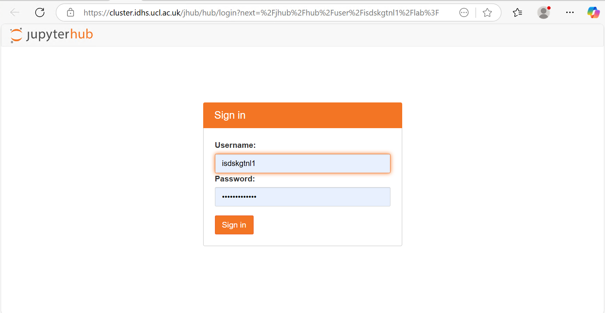
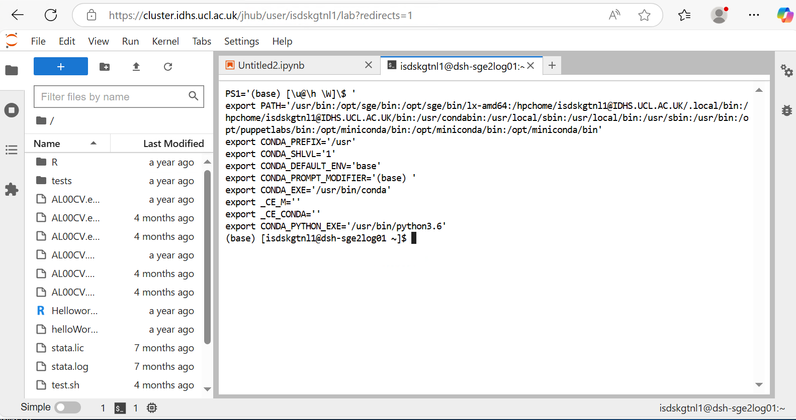

# Jupyter Hub

## Overview

The DSH HPC Cluster login nodes (and some select other DSH Research Compute machines) provide a JupyterHub service with graphical interface.

## Access

To access the service, visit the machine's URL from inside DSH. For the DSH HPC Cluster, this is: <https://cluster.idhs.ucl.ac.uk/jhub/hub/login>

You will be prompted to login with your DSH userid and password.

These Jupyter Hub instances and all of their components are only accessible from inside DSH network. 

### Jupyter Hub not starting or Initialisation Error

If you get an error pop-up in Jupyter Hub `Initialisation Error: Unable to connect to service` or an ever-spinning loading screen please, [get in touch with RC support](8-Contact_Us.md).
