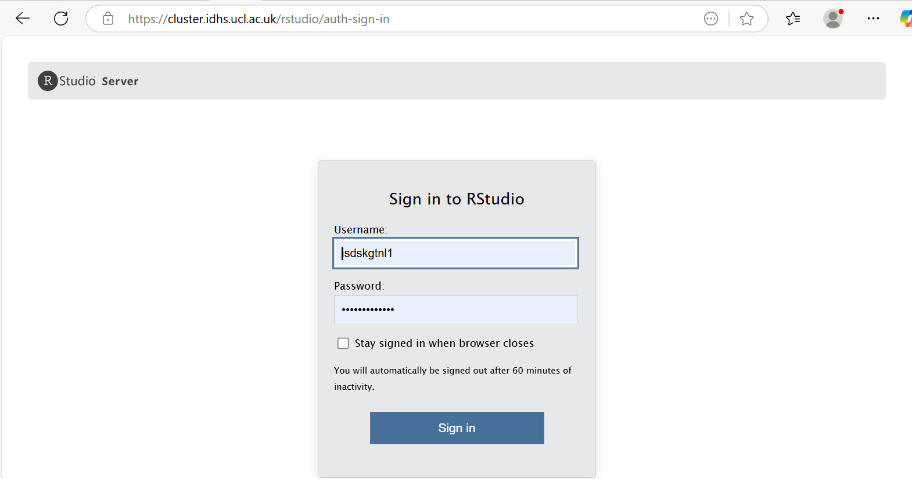
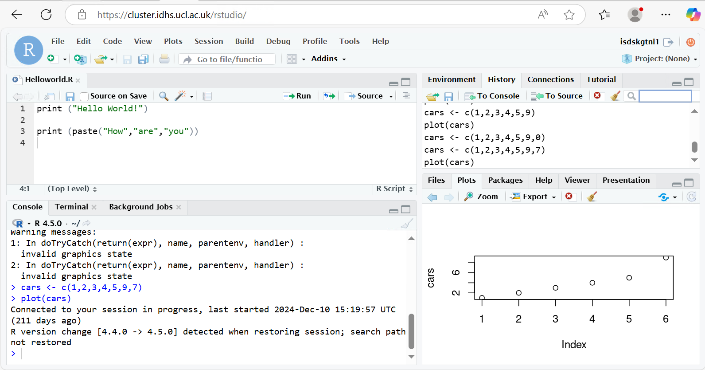

# RStudio

The DSH cluster team provide a RStudio service with graphical interface.

## Access

To access the service go to the following URL from inside DSH:

<https://cluster.idhs.ucl.ac.uk/rstudio/auth-sign-in>

Then login with your UCL userid and password.

RStudio and all of its components are only accessible from inside DSH network. 

### R session not starting or RStudio Initialisation Error

If you get an RStudio error pop-up: `Initialisation Error: Unable to connect to service` or an ever-spinning loading screen please, [get in touch with RC support](Contact_Us.md). 

