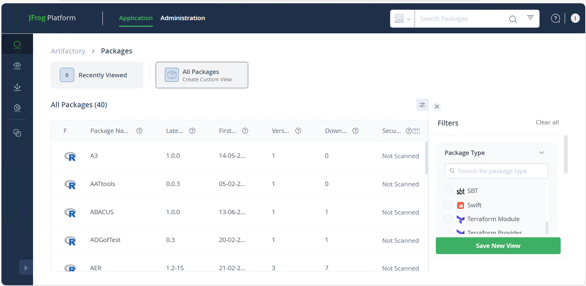

# Installing your own software

## Downloading software from Artifactory
You can install software available in Artifactory in your own space. **You can only access Artifactory from inside the DSH.**

To download and install software available in Artifactory, you must log in using your UCL credentials first, in the Artifactory website using DSH Desktop web browser (https://artifactory.idhs.ucl.ac.uk/):


The main page will show the existent packages. Some of them have been scanned and other do not. For security purposes, only already scanned packages, without vulnerabilities can be installed. 


If the package you want to install is one of them, then you can proceed to download it by pressing the download icon.


## Downloading and installing packages with R, Conda and Pip.

You can download/install packages using R, Conda and Pip. We encourage our users to create a new virtualenvs for this purpose, where only packages you are installing yourself will be in it.

### Create a virtualenv using Conda.
```
# create the new virtualenv, with any name you want
conda create --name <my-env>
# activate it
conda activate ./<my-env>
```

Your bash prompt will change to show you that a different virtualenv is active.
(This one is called `venv`).

```
(venv) [uccacxx@login03 ~]$ 
```

`deactivate` will deactivate your virtualenv and your prompt will return to normal.

You only need to create the virtualenv the first time. 


## Installing packages.

Then, you can install the packages with:

In R, use the following code in an R console to install MYPACKAGE to your cluster R library:  
`install.packages("MYPACKAGE")`

For Conda, use the following command in a terminal to install MYPACKAGE to your current conda environment:  
`conda install MYPACKAGE`

For pip, use the following command in a terminal to install MYPACKAGE to your current python environment:  
`pip install MYPACKAGE`

The installation will require the use of a **token** that must be generated using Artifactory. You can use the same token for all package types/configuration files, but this token will **need to be regenerated anytime you change your password**. Tokens should be treated similarly to passwords, in terms of keeping them secret. In DSH cluster you can use `Shift`+`Insert` to paste in Linux (`Ctrl`+`V` won't work!).

You also can create relevant configuration files inside your cluster home directory. In this config files you must copy your token, and paste it into the appropriate place. You must update this token **everytime you change your password**. Here you have some templates for the most common software: 

`~/.condarc` (for Miniconda)

`~/.Rprofile` (for R and Rstudio)

`~/.pip/pip.conf` (for Pip)


### Installing your own R packages

If we do not have R packages installed centrally that you wish to use, you can install them in your space on the cluster and tell R where to find them. First you need to tell R where to install your package to and where to look for user-installed packages, using the R library path.

#### Set your R library path

There are several ways to modify your R library path so you can pick up packages that you have installed in your own space.

The easiest way is to add them to the `R_LIBS` environment variable (insert the correct path):
```
export R_LIBS=/your/local/R/library/path:$R_LIBS
```

This is a colon-separated list of directories that R will search through. 

Setting that in your terminal will let you install to that path from inside R and should also be put in your jobscript (or your `.bashrc`) when you submit a job 
using those libraries. This appends your directory to the existing value of `$R_LIBS` rather than overwriting it so the centrally-installed libraries can still be found.
You can also change the library path for a session from within R:

```
.libPaths(c('~/MyRlibs',.libPaths()))
```

This puts your directory at the beginning of R's search path, and means that `install.packages()` will automatically put packages there and the `library()` function will find libraries in your local directory.

#### Install an R package

To install, after setting your library path:

From inside R, you can do
```
install.packages('package_name', repos="http://cran.r-project.org")
```

Or if you have downloaded the tar file, you can do
```
R CMD INSTALL -l /hpchome/username/your_R_libs_directory package.tar.gz
```
If you want to keep some libraries separate, you can have multiple colon-separated paths in your `$R_LIBS` and specify which one you want to install into with `R CMD INSTALL`.

## Generating an Artifactory token.

To generate an Artifactory token, visit the Artifactory website using DSH Desktop web browser (https://artifactory.idhs.ucl.ac.uk/), click "Artifacts" in the left panel, and then click "Set Me Up" in the top right.


Inside the "Set Me Up" interface, select a package type (doesn't matter which) and generate a personal Artifactory token by typing your password in the text box and clicking "Generate Token & Create Instructions".


Now you can use your token!

## Python

 You can create and use your own virtualenvs:
 
```
virtualenv <DIR> 
source <DIR>/bin/activate
```

Your bash prompt will show you that a different virtualenv is active.

### Installing via setup.py

If you need to install using setup.py, you can use the `--user` flag and as long as one of the python bundles is loaded, it will install into the same `.python2local` or `.python3local` as pip and you won't need to add any new paths to your environment.

```
python setup.py install --user
```
You can alternatively use `--prefix` in which case you will have to set the install prefix to somewhere in your space, and also set PYTHONPATH and PATH to include your install location. Some installs won't create the prefix directory for you, in which case create it first. This is useful if you want to keep this package entirely separate and only in
your paths on demand.

```
# For Python 2.7
export PYTHONPATH=/hpchome/username/your/path/lib/python2.7/site-packages:$PYTHONPATH  
# if necessary, create install path  
mkdir -p hpchome/username/your/path/lib/python2.7/site-packages  
python setup.py install --prefix=/hpchome/username/your/path

# add these to your .bashrc or jobscript  
export PYTHONPATH=/hpchome/username/your/path/lib/python2.7/site-packages:$PYTHONPATH  
export PATH=/hpchome/username/your/path/bin:$PATH
```

```
# For Python 3.7
# add location to PYTHONPATH so Python can find it
export PYTHONPATH=/hpchome/username/your/path/lib/python3.7/site-packages:$PYTHONPATH
# if necessary, create lib/pythonx.x/site-packages in your desired install location
mkdir -p /hpchome/username/your/path/lib/python3.7/site-packages
# do the install
python setup.py install --prefix=/hpchome/username/your/path

# It will tend to tell you at install time if you need to change or create the `$PYTHONPATH` directory.
# To use this package, you'll need to add it to your paths in your jobscript or `.bashrc`.
#Check that the `PATH` is where your Python executables were installed.

export PYTHONPATH=/hpchome/username/your/path/lib/python3.7/site-packages:$PYTHONPATH
export PATH=/hpchome/username/your/path/bin:$PATH
```

Check that the PATH is where your Python executables were installed, and the PYTHONPATH is correct.. It is very important that you keep the `:$PYTHONPATH` or `:$PATH` at the end of these - you are putting your location at the front of the existing contents of the path. If you leave them out, then only your package location will be found and nothing else.


### Python script executable paths

If you have an executable python script giving the location of python like this, and it fails because that python doesn't exist in that
location or isn't the one that has the additional packages installed:

```
#!/usr/bin/python2.7
```

You should change it so it uses the first python found in your environment. 

```
#!/usr/bin/env python 
```

## Installing software with no sudo.

You cannot install anything using `sudo`. If the instructions tell you to do that, read further to see if they also have instructions for installing in user space, or for doing an install from source if they are RPMs.

Alternatively, just leave off the `sudo` from the command they tell you to run and look for an alternative way to give it an install location if it tries to install somewhere that isn't in your space (examples for some common build systems are below).

### Automake configure

[Automake](http://www.gnu.org/software/automake/manual/automake.html)
will generate the Makefile for you and hopefully pick up sensible
options through configuration. You can give it an install prefix to tell
it where to install (or you can build it in place and not use make
install at all).

```
./configure --prefix=/hpchome/username/place/you/want/to/install
make
# if it has a test suite, good idea to use it
make test 
make install
```

If it has more configuration flags, you can use `./configure --help` to
view them.

Usually configure will create a config.log: you can look in there to
find if any tests have failed or things you think should have been
picked up haven't.

### CMake

[CMake](http://www.cmake.org/) is another build system. It will have a
CMakeFile or the instructions will ask you to use cmake or ccmake rather
than make. It also generates Makefiles for you. `ccmake` is a
terminal-based interactive interface where you can see what variables
are set to and change them, then repeatedly configure until everything
is correct, generate the Makefile and quit. `cmake` is the commandline
version. The interactive process tends to go like this:

```
ccmake CMakeLists.txt
# press c to configure - will pick up some options
# press t to toggle advanced options
# keep making changes and configuring until no more errors or changes
# press g to generate and exit
make
# if it has a test suite, good idea to use it
make test 
make install
```

The options that you set using ccmake can also be passed on the commandline to
cmake with `-D`. This allows you to script an install and run it again later.
`CMAKE_INSTALL_PREFIX` is how you tell it where to install.

```
# making a build directory allows you to clean it up more easily
mkdir build
cd build
cmake .. -DCMAKE_INSTALL_PREFIX=/hpchome/username/place/you/want/to/install
```

If you need to rerun cmake/ccmake and reconfigure, remember to delete the
`CMakeCache.txt` file first or it will still use your old options.
Turning on verbose Makefiles in cmake is also useful if your code
didn't compile first time - you'll be able to see what flags the
compiler or linker is actually being given when it fails.

### Make

Your code may come with a Makefile and have no configure, in which
case the generic way to compile it is as follows:

```
make targetname
```

There's usually a default target, which `make` on its own will use. `make all`
is also frequently used. 
If you need to change any configuration options, you'll need to edit those
sections of the Makefile (usually near the top, where the variables/flags are
defined).

Here are some typical variables you may want to change in a Makefile.

These are what compilers/mpi wrappers to use - these are also defined by
the compiler modules, so you can see what they should be. Intel would be
`icc`, `icpc`, `ifort`, while the GNU compiler would be `gcc`, `g++`, `gfortran`. 
If this is a program that can be compiled using MPI and only has a variable for CC, 
then set that to mpicc.

```
CC=gcc
CXX=g++
FC=gfortran
MPICC=mpicc
MPICXX=mpicxx
MPIF90=mpif90
```

CFLAGS and LDFLAGS are flags for the compiler and linker respectively,
and there might be LIBS or INCLUDE in the Makefile as well. When linking a library 
with the name libfoo, use `-lfoo`.

```
CFLAGS="-I/path/to/include"
LDFLAGS="-L/path/to/foo/lib -L/path/to/bar/lib"
LDLIBS="-lfoo -lbar"
```

Remember to `make clean` first if you are recompiling with new options. This will delete
object files from previous attempts. 

## Set your PATH and other environment variables

After you have installed your software, you'll need to add it to your
`PATH` environment variable so you can run it without having to give the
full path to its location.

Put this in your `~/.bashrc` file so it will set this with every new session you
create. Replace username with your username and point to the directory
your binary was built in (frequently `program/bin`). This adds it to the
front of your PATH, so if you install a newer version of something, it
will be found before the system one.

```
export PATH=/hpchome/username/location/of/software/binary:$PATH
```

If you built a library that you'll go on to compile other software with,
you probably want to also add the lib directory to your
LD\_LIBRARY\_PATH and LIBRARY\_PATH, and the include directory to CPATH
(add export statements as above). This may mean your configure step will
pick your library up correctly without any further effort on your part.

To make these changes to your .bashrc take effect in your current
session:

```
source ~/.bashrc
```

#### Troubleshooting: remove your pip cache

If you built something and it went wrong, and are trying to reinstall it with `pip` and keep 
getting errors that you think you should have fixed, you may still be using a previous cached version. 
The cache is in `.cache/pip` in your home directory, and you can delete it.

You can prevent caching entirely by installing using `pip3 install --user --no-cache-dir <python3pkg>`


